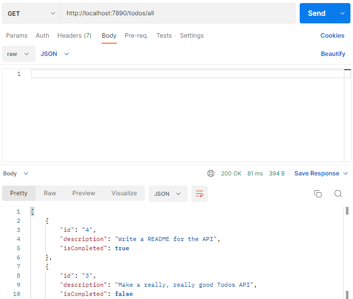

# Todos API

This Todos API was written with Express.js and uses a PostgreSQL database. With it you can sign in, make new todos, edit your todos, mark them as finished, etc. It's easiest to explore with an API tester like Postman.

## Getting Started

You need Postgres installed to get the database running. [Here are instructions](https://www.postgresqltutorial.com/postgresql-getting-started/install-postgresql/) for installing Postgres if you don't have it already. This project uses Postgres's default server port 5432.

After cloning the repo locally, rename the .env.example file to .env to access the variables.

Run `npm i` for dependencies.

Run `npm run setup-db` to get the database started.

Run `npm start` and we should be ready for business.

In Postman, use `http://localhost:7890` to access the server.

## Database

The database is made of two tables, `users` and `todos`.

`users` has three columns: `id`, `email`, and `password_hash`.

`todos` has four columns: `id`, `user_id`, `description`, and `is_completed`. `description` is where the todo content is kept. `is_completed` is a boolean.

## Users Routes

POST an email and password to `/users` to sign up a new user. This route is "inauthenticated" (probably not what it should be called), meaning it can't be accessed if you're signed in. The same email can't be registered twice.

POST an email and password to `/users/sessions` to log in, if that user info has been signed up. This route is also inauthenticated.

DELETE `/users/sessions` to sign out. This route is authenticated.

GET `/users/id` returns info of the user with that id.

## Todos Routes

All `/todos` routes are authenticated. Users can only see their own todos.

POST a description to `/todos` to create a new todo.

GET `/todos` returns all your incomplete todos.

GET `/todos/id` returns your todo with that id.

PUT a new description to `/todos/id`, where `id` is the id of a todo you've already made, to edit that todo.

DELETE `/todos/id` to mark a todo as completed. It will no longer show up on the GET `/todos` route. You can still find it at its GET `/todos/id` route and you'll see its `isCompleted` property is `true`.

GET `/todos/all` returns all your todos, completed and not completed.

